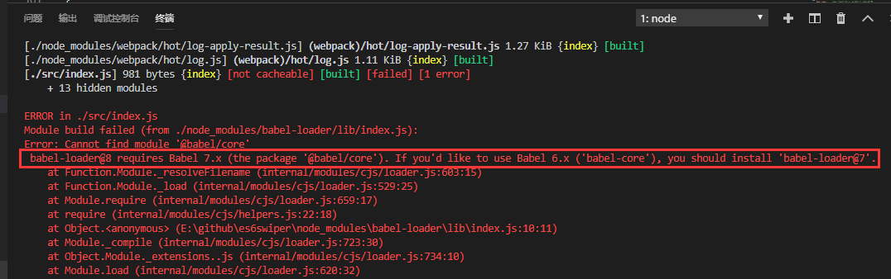
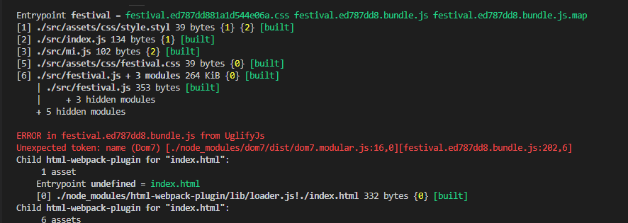

# Swiper的使用demo

## 一、初始化项目和安装包
1. `npm init -y`
2. 安装webpack4.x:          
`yarn add webpack webpack-cli -D`
3. 安装webpack的基本loader    
`yarn add -D style-loader css-loader file-loader stylus stylus-loader url-loader`
4. 添加webpack.config.js并配置  
注：webpack中rules中的loader的顺序是从右到左   
如`{test: /\.css$/, use: ['style-loader','css-loader']}`,先`css-loader`再`style-loader`

```js
const path = require('path')

module.exports = {
    entry: './src/index.js',
    output: {
        filename: '[name].bundle.js',
        path: path.resolve(__dirname,'dist')
    },
    module: {
        rules:[
            {test: /\.css$/, use: ['style-loader','css-loader']}
        ]
    }
}
```
5. package.json的scripts中添加打包脚本
`"build":"webpack --confg webpack.config.js"`
6. 安装和使用 webpack的插件 (html-webpack-plugin和clean-webpack-plugin)      
`yarn add -D html-webpack-plugin clean-webpack-plugin`

```javascript
在html中使用配置项的值
<%= htmlWebpackPlugin.options.title %>

const HtmlWebpackPlugin = require('html-webpack-plugin')
const CleanWebpackPlugin = require('clean-webpack-plugin')

plugins: [
        new CleanWebpackPlugin(['dist']),
        new HtmlWebpackPlugin({
            title: '首页',
            template: 'index.html'
        })
    ]
```
## 二、样式处理
1. 样式编写使用`stylus`,所以`webpack.config.js`中对样式的处理要加上`stylus-loader`
```js
module: {
    rules:[
        {test: /\.(css|styl)$/, use: ['style-loader','css-loader','stylus-loader']}
    ]
}
```
2. `src/index.js`中`import`引入样式
```js
import './css/style.styl'
```
3. 将样式打包到css文件中（而不是页面上的`<style>...</style>`引入的）
需要用到webpack的插件(webpack4.x之后的版本使用) `mini-css-extract-plugin` [github地址](https://github.com/webpack-contrib/mini-css-extract-plugin)
- 安装  `yarn add -D mini-css-extract-plugin`
- 在webpack.config.js文件中配置并使用
```js
const MiniCssExtractPlugin = require("mini-css-extract-plugin");      // 把样式打包成文件只在生产环境下使用
const devMode = process.env.NODE_ENV !== 'production'

module.exports = {
    module: {
        rules:[
            {test: /\.(css|styl)$/, use: [{
                loader: devMode ? 'style-loader' : MiniCssExtractPlugin.loader,
            },'css-loader','stylus-loader']}
        ]
    },
    plugins: [
        new MiniCssExtractPlugin({
            // Options similar to the same options in webpackOptions.output
            // both options are optional
            filename: devMode ? '[name].css' : '[name].[hash].css',
            chunkFilename: devMode ? '[id].css' : '[id].[hash].css',
        }),
        new CleanWebpackPlugin(['dist']),
        new HtmlWebpackPlugin({
            title: '首页',
            template: 'index.html'
        })
        
    ]
}
```
4. 上面的配置,要把样式打包到单独的文件中是需要是生产环境下,也即是默认使用`style-loader`(页面会style一个一个样式文件),    需要再安装`cross-env` 所以安装 `cross_env`   `yarn add -D cross-env` 参考：https://www.cnblogs.com/usebtf/p/9912413.html  
5. 修改`package.json`的脚本：
```js
"scripts": {
    "dev": "webpack --confg webpack.config.js",
    "build": "cross-env NODE_ENV=production webpack --confg webpack.config.js"
  }
```
此时再执行`npm run build`可以看到会生成单独的样式文件    

上图中的黄色部分可以看出,`webpack`没有指定`mode`的情况下默认是`production` 再次更新下`package.json`的脚本
```js
"scripts": {
    "dev": "cross-env NODE_ENV=development webpack --confg webpack.config.js",
    "build": "cross-env NODE_ENV=production webpack --confg webpack.config.js"
  }
```
同时给`webpack.config.js`增加个`mode的设置项`, 再次打包会看到没有黄色部分的warning了
```js
mode: devMode? 'development': 'production',
```
其实也可以用传入环境变量参数的方式处理,但是必须把`webpack.config.js`改成函数的方式[详情参照](https://www.webpackjs.com/guides/environment-variables/)
6. 开发环境下为了方便调试样式,启用样式的sourcemap
继续修改`webpack.config.js`下的`rules`
```js
module: {
        rules:[
            {test: /\.(css|styl)$/, use: [
                { loader: devMode ? 'style-loader' : MiniCssExtractPlugin.loader },
                { loader:'css-loader',options: {sourceMap: true} },
                { loader: 'stylus-loader',options: {sourceMap: true} }
            ]}
        ]
    },
```
如果是要在生产环境下也要看到sourcemap必须先启用webpack.config.js的配置项 `devtool: 'sourcemap'`      
基于以上的配置很多都是要分开发环境和生产环境,所以后续要把配置都分开来,相同的部分放common里面    
`npm run dev`可以查看到sourcemap


## 三、将`webpack`的开发环境配置和生产环境的配置分开来
根目录下建立config文件夹,并建立`webpack.common.js`-共用配置,`webpack.dev.js`-开发配置,`webpack.prod.js`-生产配置
[可以参照](https://www.webpackjs.com/guides/production/)
1. 首先安装 `webpack-merge`    `yarn add webpack-merge -D`
2. `webpack.common.js`
```js
const path = require('path')
const HtmlWebpackPlugin = require('html-webpack-plugin')
const CleanWebpackPlugin = require('clean-webpack-plugin')

module.exports = {
    entry: {
        index: path.resolve(__dirname,'../src/index.js')
    },
    output: {
        filename: '[name].[hash:8].bundle.js',
        path: path.resolve(__dirname,'../dist')
    },
    plugins: [ 
        new CleanWebpackPlugin(['dist'],{root: path.resolve(__dirname, '../')}),       
        new HtmlWebpackPlugin({
            title: '首页',
            template: 'index.html'
        })        
    ]
}
```
3. webpack.dev.js
```js
const merge = require('webpack-merge')
const common = require('./webpack.common.js')

module.exports = merge(common,{
    mode: 'development',
    devtool: 'inline-sourcemap',
    module: {
        rules:[
            {test: /\.(css|styl)$/, use: [
                'style-loader',
                { loader:'css-loader',options: {sourceMap: true} },
                { loader: 'stylus-loader',options: {sourceMap: true} }
            ]}
        ]
    }
})
```
4.`webpack.prod.js`
```js
const webpack = require('webpack')
const merge = require('webpack-merge')
const common = require('./webpack.common.js')


const MiniCssExtractPlugin = require("mini-css-extract-plugin");      // 把样式打包成文件只在生产环境下使用

module.exports = {
    mode: 'production',
    devtool: 'sourcemap',
    output: {
        filename: '[name].[hash:8].bundle.js'
    },
    module: {
        rules:[
            {test: /\.(css|styl)$/, use: [
                { loader: MiniCssExtractPlugin.loader },
                { loader:'css-loader',options: {sourceMap: true} },
                { loader: 'stylus-loader',options: {sourceMap: true} }
            ]}
        ]
    },
    plugins: [
        new MiniCssExtractPlugin({
            // Options similar to the same options in webpackOptions.output
            // both options are optional
            filename: '[name].[hash:8].css',
            chunkFilename: '[id].[hash:8].css'
        }),
        new webpack.DefinePlugin({
            'process.env.NODE_ENV': JSON.stringify('production')
        })
    ]
}
```

## 四、`postcss`处理样式(如带前缀)
1. 安装:`yarn add postcss-loader -D`
2. 安装：`yarn add autoprefixer -D`
3. 修改`webpack.prod.js`
```js
module: {
        rules:[
            {test: /\.(css|styl)$/, use: [
                { loader: MiniCssExtractPlugin.loader },
                { loader:'css-loader',options: {sourceMap: true} },
                { loader:'postcss-loader',options: {
                    ident: 'postcss',
                    sourceMap: true,
                    plugins: loader => [
                        require('autoprefixer')({browsers:['>0.15% in CN']})
                    ]
                    } 
                },
                { loader: 'stylus-loader',options: {sourceMap: true} }
            ]}
        ]
    },
```
## 五、压缩样式
1. 安装插件 `yarn add optimize-css-assets-webpack-plugin -D`
2. 修改 `webpack.prod.js`
```js
const optimizeCss = require('optimize-css-assets-webpack-plugin')
...

    optimization: {
        minimizer: [new optimizeCss()]
    }
```
## 六、压缩js
1. 安装插件 `yarn add uglifyjs-webpack-plugin -D`
2. 修改 `webpack.prod.js`
```js
const UglifyJsPlugin = require('uglifyjs-webpack-plugin')
...

    optimization: {
        minimizer: [
            new UglifyJsPlugin({     //压缩js
                cache: true,
                parallel: true,
                sourceMap: true
            }),
            new optimizeCss()      //压缩css
        ]
    }
```
## 七、加载图片资源并优化  用到的`file-loader`(上面已经安装过)
1. `webpack.dev.js`,`webpack.prod.js`都增加
```js
{
    test: /\.(png|svg|jpg|gif)$/,
    use: [
        'file-loader'
    ]
}
```
2. 对图片资源进行优化,压缩图片优化用到了`image-webpack-loader`  
base64转换用到了`url-loader`,所以结合在一起安装     
注：`url-loader`的执行返回默认就是`file-loader`所以base64那一步把`file-loader`换成`url-loader`,然后配上相应的参数。
```bash
yarn add image-webpack-loader url-loader -D
```
对`webpack.prod.js`修改
```js
{
    test: /\.(png|svg|jpe?g|gif)$/,
    use: [
        { 
            loader: 'url-loader',
            options: {
                limit: 10240       //base64限制值10kb
            }
        },
        {
            loader: 'image-webpack-loader',
            options: {
                mozjpeg: {
                    progressive: true,
                    quality: 65
                },
                // optipng.enabled: false will disable optipng
                optipng: {
                    enabled: false,
                },
                pngquant: {
                    quality: '65-90',
                    speed: 4
                },
                gifsicle: {
                    interlaced: false,
                },
                // the webp option will enable WEBP
                webp: {
                    quality: 75
                }
            }
        }
    ]
},
```

## 八、开发服务器`webpack-dev-server`
1. 安装：`yarn add webpack-dev-server -D`
2. 配置`webpack.dev.js`  [具体配置可参照](https://www.webpackjs.com/configuration/dev-server/)
```js
devtool: 'inline-source-map',
devServer: {
    contentBase: path.join(__dirname, "../dist"),
    compress: true,      //一切服务都启用gzip 压缩
    hot: true,//启用模块热替换特性，这个需要配合：webpack.HotModuleReplacementPlugin插件
    host: '0.0.0.0', //指定一个host,默认是localhost,如果想开发的时候外部能访问,设置成0.0.0.0
    port: 8080,
    publicPath:'/',
    proxy: {
        "/api": {
            target: 'http://192.168.0.167:8080'
        }
    }
},
```
3. 修改`package.json`中的脚本
```js
"dev": "webpack-dev-server --open --config config/webpack.dev.js",
```
## 九、js启用babel转码
1. 安装：`yarn add babel-core babel-loader babel-preset-env -D`
2. 修改`webpack.common.js`    ***babel的转码dev打包和prod打包都需要，所以放在common里面***
```js
module: {
    rules: [
        {
            test: /\.js$/,
            exclude: /node_modules/,
            use: ['babel-loader']
        },
        ...
    ]
}
```
3. 在这一步打包的时候会出错(安装的bable-loader是8.x版本,而babel-core是6.x-对应的babel-loader需要@7版本)如下图所示：
babel-loader@8 requires Babel 7.x (the package '@babel/core')

解决办法就是
+ `npm uninstall babel-loader`  --先移除最新版，再安装@7版本
+ `yarn add -D babel-loader@7`       --上面安装的babel-core是6.x版本要使用7.x版本的babel-loader
## 十、eslint代码风格检查
1. 安装：`yarn add eslint eslint-loader babel-eslint standard -D`
2. eslint的包`yarn add eslint-plugin-html eslint-config-standard eslint-plugin-import eslint-plugin-node eslint-plugin-standard -D`
3. 修改`webpack.common.js`
```js
module: {
    rules: [
        {
            test: /\.js$/,
            exclude: /node_modules/,
            use: [
                'babel-loader',    //先检查代码风格,再进行转码,所以这里注意两者的顺序
                {
                    loader: 'eslint-loader',
                    options: {
                        fix: true
                    }
                }
            ]
        }
    ]
}
```
4. eslint的配置文件 `.eslintrc.js`
```js
// http://eslint.org/docs/user-guide/configuring

module.exports = {
    //此项是用来告诉eslint找当前配置文件不能往父级查找
    root: true, 
    //此项是用来指定eslint解析器的，解析器必须符合规则，babel-eslint解析器是对babel解析器的包装使其与ESLint解析
    parser: 'babel-eslint',
    //此项是用来指定javaScript语言类型和风格，sourceType用来指定js导入的方式，默认是script，此处设置为module，指某块导入方式
    parserOptions: {
        sourceType: 'module'
    },
    //此项指定环境的全局变量，下面的配置指定为浏览器环境
    env: {
        browser: true,
    },
    // https://github.com/feross/standard/blob/master/RULES.md#javascript-standard-style
    // 此项是用来配置标准的js风格，就是说写代码的时候要规范的写，如果你使用vs-code我觉得应该可以避免出错
    extends: 'standard',
    // required to lint *.vue files
    // 此项是用来提供插件的，插件名称省略了eslint-plugin-，下面这个配置是用来规范html的
    plugins: [
        'html'
    ],
    // add your custom rules here
    // 下面这些rules是用来设置从插件来的规范代码的规则，使用必须去掉前缀eslint-plugin-
    // 主要有如下的设置规则，可以设置字符串也可以设置数字，两者效果一致
    // "off" -> 0 关闭规则
    // "warn" -> 1 开启警告规则
    //"error" -> 2 开启错误规则
    // 了解了上面这些，下面这些代码相信也看的明白了
    'rules': {
        // allow paren-less arrow functions
        'arrow-parens': 0,
        // allow async-await
        'generator-star-spacing': 0,
        // allow debugger during development
        'no-debugger': process.env.NODE_ENV === 'production' ? 2 : 0,
        'no-console': 'off'
    }
}
```

## 十一、`webpack`的`resolve`选项
`resolve`选项能设置模块如何被解析,常常会配置`resolve.alias` 创建 import 或 require 的别名，来确保模块引入变得更简单。    
在`webpack.common.js`中添加
```js
resolve: {
    alias: {
        '@': path.resolve(__dirname,'../src'),
        Utilities: path.resolve(__dirname, '../src/utilities/'),
        Templates: path.resolve(__dirname, '../src/templates/')
    }
}
```
注意上面的@配置项, 当样式里面用 `@import`引入样式的时候要记得前面加个~符号
如：
```css  
@import '~@/css/style.styl';
```
## 十二、加载字体
```js
{
    test: /\.(woff|woff2|eot|ttf|otf)$/,
    use: [ 'file-loader' ]
}
```

## 十三、处理html中引入的图片
1. 安装`html-loader`: `yarn add html-loader -D`  [github网址](https://github.com/webpack-contrib/html-loader)
2. 配置 `config/webpack.common.js`
```js
{
    test: /\.(html)$/,
    use: {
        loader: 'html-loader',
        options: {
            attrs: ['img:src', 'img:data-src', 'audio:src', 'link:href'],
            minimize: true,
            root: path.resolve(__dirname, '../src/assets')                        
        }
    }
}
```

## 十四、多页面入口文件处理
`config/webpack.common.js`
```js
entry: {
    index: path.resolve(__dirname,'../src/index.js'),
    mi: path.resolve(__dirname,'../src/mi.js'),
    festival: path.resolve(__dirname,'../src/festival.js'),
},

plugins: [
    ...
    new HtmlWebpackPlugin({
        title: '首页',
        template: 'index.html',
        chunks:['index']
    }),        
    new HtmlWebpackPlugin({
        title: '小米官网焦点图制作',
        template: 'mi.html',
        filename:'mi.html',
        chunks:['mi']
    }),
    new HtmlWebpackPlugin({
        title: '端午节',
        template: 'festival.html',
        filename:'festival.html',
        chunks:['festival']
    }),
]
```
由于webpack的配置中使用了`html-loader`,导致.html的文件变成了正常的模板，所以页面中`<%= htmlWebpackPlugin.options.title %>`无法解析`HtmlWebpackPlugin`中定义的`title`,        
最简单的的方式就是直接在html中定义页面标题

## 十五、打包时的`dom7`错误
               
大致的原因是  swiper4.x或者dom7中使用了es6的语法, 而uglify压缩js不能有es6语法,所以报错,解决办法就是将swiper和dom7先用babel-loader解析(变成了es5),       
然后再压缩就不会报错了, 修改 `config/webpack.common.js`和js `babel-loader`部分
```js
rules: [
    {
        test: /\.js$/,
        include:[
            path.resolve(__dirname,'../src'),
            path.resolve(__dirname,'../node_modules/swiper'),
            path.resolve(__dirname,'../node_modules/dom7')
        ],
        use: [
            'babel-loader',
            {
                loader: 'eslint-loader',
                options: {
                    fix: true
                }
            }
        ]
    },
]
```
别忘了在根目录下配置 `.babelrc`
```json
{
    "presets": ["env"]
}
```